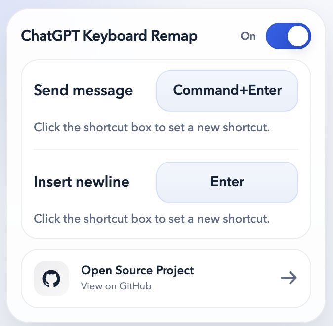

# ChatGPT Keyboard Remap

An extension that remaps ChatGPT's composer shortcuts so writing multi-line prompts feels more natural.

By default:

- `Enter` inserts a newline
- `Ctrl+Enter` sends on Windows/Linux
- `Command+Enter` sends on macOS

This extension adds a lightweight popup settings panel, lets you set shortcuts directly from compact shortcut boxes, stores preferences with `chrome.storage.sync`, applies changes without a page reload when possible, and handles IME composition safely for Chinese, Japanese, and Korean input.

---

## ✨ Features

- **Natural Composer Behavior**: Remap ChatGPT so `Enter` inserts a newline and a modifier shortcut sends the message.
- **Direct Shortcut Recording**: Click the shortcut box for send or newline, then press the shortcut you want to use.
- **Platform-Aware Defaults**: Uses `Command+Enter` by default on macOS and `Ctrl+Enter` by default on Windows/Linux.
- **Concise Popup UI**: Includes a compact popup with a header toggle, inline shortcut boxes, and a quick link to the GitHub repo.
- **Lightweight Implementation**: Built with plain HTML, CSS, and JavaScript. No framework or build step required.
- **Low Runtime Overhead**: No polling, no MutationObserver loop, and no continuous DOM scanning.
- **IME-Safe Handling**: Avoids interfering while input composition is active.
- **Immediate Updates**: Settings are stored in `chrome.storage.sync` and applied to open ChatGPT tabs without requiring a full restart.
- **Native Fallback Behavior**: Only the configured send shortcut and configured newline shortcut are remapped. Other supported shortcuts keep ChatGPT's original behavior.

---

## How to Install (Chrome / Edge)

### ✅ Manual Installation

1. Download or clone this repository.
2. If you downloaded a ZIP from GitHub, extract it first.
3. Open your browser and go to: `chrome://extensions/`
4. Enable **Developer mode**.
5. Click **Load unpacked**.
6. Select this project folder: `chatgpt-keyboard-remap`

> After installation, open `https://chatgpt.com/` or `https://chat.openai.com/`, click the extension icon, and adjust the shortcuts if needed.

---

## Supported Shortcut Format

This extension records **Enter-based shortcuts** only.

You can use:

- `Enter`
- `Shift+Enter`
- `Ctrl+Enter`
- `Command+Enter`
- `Alt+Enter`
- combinations such as `Command+Shift+Enter` when your platform provides those modifiers

---

## How It Works

- `manifest.json` registers the popup and injects the content script on ChatGPT pages.
- `shared.js` contains the shared settings model, platform detection, shortcut recording and formatting logic, plus storage helpers.
- `content.js` watches the real ChatGPT composer, remaps only the configured shortcuts, and clicks ChatGPT's native send button when sending.
- The content script keeps runtime work small by caching the active composer and only doing extra DOM queries when `Enter` is pressed inside the prompt.
- `popup.html`, `popup.css`, and `popup.js` provide the compact settings UI, clickable shortcut boxes, and persistence through `chrome.storage.sync`.

For newline insertion, the extension first tries to follow ChatGPT's native `Shift+Enter` behavior, then falls back to direct editable updates only when necessary.

---

## Known Limitations

- ChatGPT's DOM is private and may change over time.
- Sending prefers ChatGPT's real send button; if the button can no longer be found, the extension fails quietly instead of forcing unrelated form submissions.
- Only `Enter`-based shortcuts are supported.

---

## Manual Test Checklist

1. Load the extension as unpacked.
2. Open ChatGPT.
3. Confirm the default behavior:
   - `Enter` inserts a newline
   - `Ctrl+Enter` sends on Windows/Linux
   - `Command+Enter` sends on macOS
4. Open the popup and click the shortcut box for send or newline.
5. Press the new shortcut and verify the mapping works immediately.
6. Disable the extension and confirm ChatGPT returns to its native behavior.
7. Start a new conversation and confirm the remap still works.
8. If you use a CJK IME, verify that pressing `Enter` during composition does not send the message.

---

## License

This project is open-sourced under the [MIT License](LICENSE).
